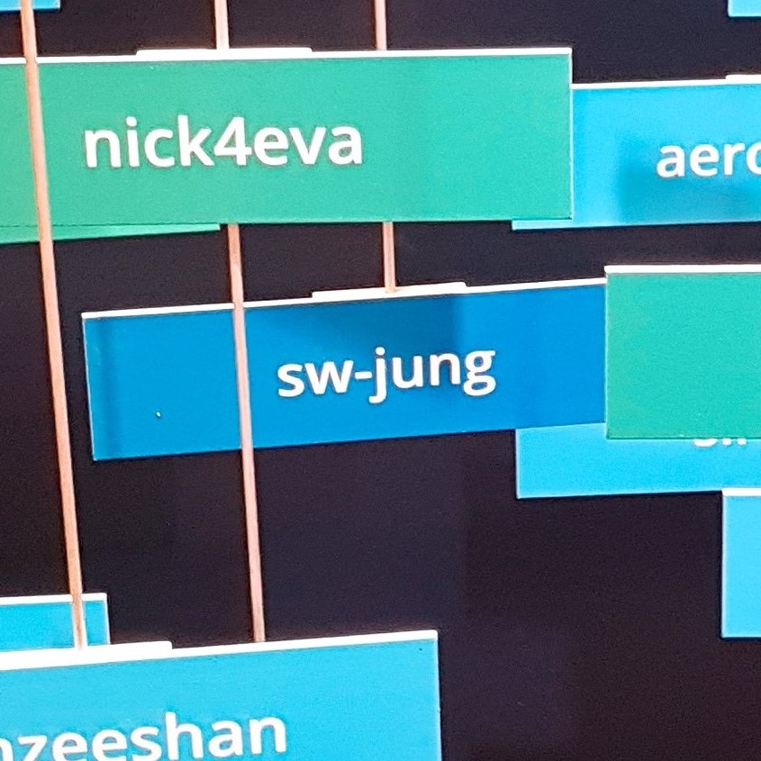

<!-- .slide: class="center" data-background="#015571" -->
# Kibana Update

## Recap Elastic{ON} 2018

2018.04.05 &nbsp; sw-jung@openbase

---

<!-- .slide: data-background="images/illustration-city-skyline-elasticon-tour.svg" data-background-position="bottom" data-background-size="100%" data-background-color="#F5F5F5" -->
## Elastic{ON} 2018

2018.02.27~2018.03.01

San Francisco

---

<!-- .slide: class="center" data-background="#08A0A5" -->
# Review 2017

---

<!-- .slide: class="center" data-background="images/2017/home.png" data-background-size="100%" data-background-position="top" data-background-color="#F5F5F5" -->
## Home <!-- .element: class="jumbotron caption" -->

---

<!-- .slide: class="center" data-background="images/2017/discover.png" data-background-size="100%" data-background-position="top" data-background-color="#F5F5F5" -->
## Discover <!-- .element: class="jumbotron caption" -->

---

<!-- .slide: class="center" data-background="images/2017/visualizations.png" data-background-size="contain" data-background-color="#F5F5F5" -->
<div class="jumbotron caption">
  <h2>Visualizations</h2>
  TagCloud, HeatMap, TSVB, ...
</div>

---

<!-- .slide: class="center" data-background="images/2017/monitoring.png" data-background-size="contain" data-background-position="center" data-background-color="#F5F5F5" -->
## Monitoring <!-- .element: class="jumbotron caption" -->

---

<!-- .slide: class="center" data-background="images/2017/what_is_cookin_in_kibana.jpg" data-background-size="contain" data-background-color="#000" -->
<div class="jumbotron caption">
@See [What's cookin'n kibana? (2017)](https://www.elastic.co/kr/elasticon/conf/2017/sf/what-is-cookin-in-kibana)
</div>

---

<!-- .slide: class="center" data-background="#08A0A5" -->
# Recap 2018

---

<!-- .slide: class="center" data-background="images/2018/security.png" data-background-size="85%" data-background-position="top" data-background-color="#F5F5F5" -->
<div class="jumbotron caption">
  <h2>More Security Features</h2>
  Role based access control, More authentication options
</div>

---

<!-- .slide: class="center" data-background="images/2018/l10n.png" data-background-size="85%" data-background-position="center" data-background-color="#F5F5F5" -->
## Localization <!-- .element: class="jumbotron caption" -->

---

<!-- .slide: class="center" data-background="images/2018/query_autocomplete.gif" data-background-size="contain" data-background-color="#F5F5F5" -->
<div class="jumbotron caption">
  <h2>Query Autocomplete</h2>
  Fields, operators and values
</div>

---

<!-- .slide: class="center" data-background="images/2018/index_management.png" data-background-size="100%" data-background-color="#F5F5F5" -->
## Index Management <!-- .element: class="jumbotron caption" -->

---

<!-- .slide: class="center" data-background="images/2018/lifecycle.png" data-background-size="contain" data-background-position="top" data-background-color="#F5F5F5" -->
## Index Lifecycle Management <!-- .element: class="jumbotron caption" -->

---

<!-- .slide: class="center" data-background="images/2018/rollup.png" data-background-size="contain" data-background-position="top" data-background-color="#F5F5F5" -->
## Rollup UI <!-- .element: class="jumbotron caption" -->

---

<!-- .slide: class="center" data-background="images/2018/new_design.png" data-background-size="contain" data-background-color="#F5F5F5" -->
<div class="jumbotron caption">
  <h2>New Design</h2>
  Built with EUI, for 7.x
</div>

---

<!-- .slide: class="center" data-background="images/2018/eui.png" data-background-size="100%" data-background-position="top" data-background-color="#F5F5F5" -->
<div class="jumbotron caption">
  @See [Elastic UI framework](https://elastic.github.io/eui/)
</div>

---

<!-- .slide: class="center" data-background="images/2018/infra_overview.png" data-background-size="contain" data-background-color="#F5F5F5" -->
<div class="jumbotron caption">
  <h2>Infra UI</h2>
  with Waffle map
</div>

---

<!-- .slide: class="center" data-background="images/2018/infra_system.png" data-background-size="contain" data-background-color="#F5F5F5" -->
<div class="jumbotron caption">
  <h2>Infra UI</h2>
  Based on Metricbeat
</div>

---

<!-- .slide: class="center" data-background="images/2018/logging.png" data-background-size="contain" data-background-position="10%" data-background-color="#F5F5F5" -->
<div class="jumbotron caption">
  <h2>Logging UI</h2>
  - tail -f  
  - search and filtering  
  - Live streaming  
  - Inline annotaions  
</div>

---

<!-- .slide: class="center" data-background="images/2018/apm.gif" data-background-size="contain" data-background-color="#F5F5F5" -->
## APM <!-- .element: class="jumbotron caption" -->

---

<!-- .slide: class="center" data-background="images/2018/canvas_coffee.png" data-background-size="100%" data-background-color="#F5F5F5" -->
<div class="jumbotron caption">
  <h2>Canvas</h2>
  @See [But First, Coffee...](https://www.elastic.co/blog/elasticon-kibana-canvas-story-elasticoffee)
  <!-- TODO: 이미지 고화질로 변경 -->
  <!-- TODO: 가능하면 데모 시연 -->
</div>

---

<!-- .slide: class="center" data-background="images/2018/canvas_ama.png" data-background-size="100%" data-background-color="#F5F5F5" -->
<div class="jumbotron caption">
  <h2>Canvas</h2>
  @See [Here to Help...](https://www.elastic.co/blog/elasticon-kibana-canvas-story-ama)
</div>

---

<!-- .slide: class="center" data-background="images/2018/canvas_examples.png" data-background-size="100%" data-background-color="#F5F5F5" -->
<div class="jumbotron caption">
  <h2>Canvas</h2>
  @See [Technical preview site](http://canvas.elastic.co)
</div>

---

<!-- .slide: class="center" data-background="images/2018/map.png" data-background-size="100%" data-background-position="top" data-background-color="#F5F5F5" -->
<div class="jumbotron caption">
  <h2>New Map Vis</h2>
  Multiple layers, Vector map, Spatial join, ...
</div>

---

<!-- .slide: data-background="images/2018/new_core.png" data-background-size="40%" data-background-position="90% 95%" data-background-color="#F5F5F5" -->
## New platform for plugins

- Tighter plugin integrations

```javascript
class MyPlugin {
  dependsOn = ['timepicker']

  start(core, dependencies) {
    core.applications.register('myapp')

    dependencies.timepicker.setTimeRange('now-15m')
  }
}
```

- Down with exact version matching!

- Goodbye "optimizing bundles"

note:
- New platform for plugins
  - Tighter plugin integrations
  - Down with exact version matching!
  - Goodbye "optimizing bundles"
  - Plugins disabled when something they depend on is disabled
  - Plugins can have their own node_modules
  - Want to use flow? CoffeScript? Elm? No problem, you do yo.
- New technologies in core: React, RxJS, TypeScript

---

<!-- .slide: data-background="images/2018/x-pack.png" data-background-size="contain" data-background-color="#000" -->
## Open X-Pack <!-- .element: class="jumbotron caption" -->

---

<!-- .slide: data-background="#F5F5F5" -->
## Links

<dl class="dl-small">
  <dt>Elastic{ON} 2018 Opening Keynote</dt>
  <dd>https://www.elastic.co/elasticon/conf/2018/sf/opening-keynote</dd>
  <dt>What's cookin'n kibana? (2017)</dt>
  <dd>https://www.elastic.co/kr/elasticon/conf/2017/sf/what-is-cookin-in-kibana</dd>
  <dt>What's cooking in kibana (2018)</dt>
  <dd>https://www.elastic.co/elasticon/conf/2018/sf/whats-cooking-in-kibana</dd>
  <dt>Elastic UI framework</dt>
  <dd>https://elastic.github.io/eui</dd>
  <dt>But First, Coffee... (An Elastic{ON} Canvas Story)</dt>
  <dd>https://www.elastic.co/blog/elasticon-kibana-canvas-story-elasticoffee</dd>
  <dt>Here to Help... (An Elastic{ON} Canvas Story)</dt>
  <dd>https://www.elastic.co/blog/elasticon-kibana-canvas-story-ama</dd>
  <dt>Canvas technical preview site</dt>
  <dd>http://canvas.elastic.co</dd>
</dl>

---

<!-- .slide: class="center" data-background="images/pictures/contact_background.jpg" data-background-color="#000" -->
<div class="jumbotron" style="display:flex; align-items: center; justify-content: center;">
  <!-- .element: class="avatar" style="width:5em" -->
  <dl class="dl-horizontal">
    <dt>Email</dt>
    <dd>[kjss10@gmail.com](mailto:kjss10@gamil.com)</dd>
    <dt>GitHub</dt>
    <dd>https://github.com/sw-jung</dd>
    <dt>LinkedIn</dt>
    <dd>https://www.linkedin.com/in/sw-jung</dd>
  </dl>
</div>

---

<!-- .slide: data-background-video="images/thankyou_elastic.mp4" -->
## Thank You! <!-- .element: class="jumbotron" -->
